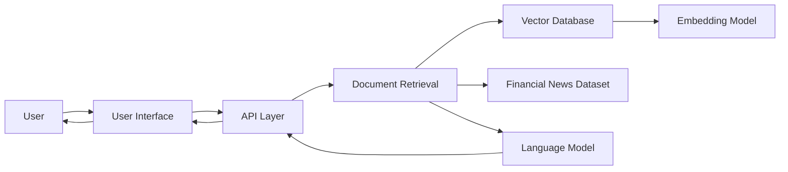

# RAG Assistant – Financial News

An AI-powered Retrieval-Augmented Generation (RAG) assistant designed to analyze financial news and provide intelligent responses to user queries.

The system retrieves relevant financial news articles and contextual information, then uses a large language model to generate accurate and context-aware answers.

This project demonstrates how RAG pipelines, vector databases, and LLMs can be integrated to build an intelligent financial news assistant.

---

# Project Overview

Financial markets generate massive amounts of information every day. Extracting useful insights from this data can be challenging.

The RAG Assistant for Financial News helps users quickly analyze financial news and obtain contextual answers through natural language queries.

The system integrates:

- Financial news data sources
- Retrieval-based search
- Large language models
- Vector embeddings
- Interactive query interface

Retrieval-Augmented Generation (RAG) combines document retrieval with language generation to produce answers grounded in external knowledge, improving accuracy and reducing hallucinations. :contentReference[oaicite:0]{index=0}

---

# System Architecture



---

# Core System Components

## 1. User Interface

The user interface allows users to interact with the system by submitting financial queries.

Capabilities include:

- Query input for financial news questions
- Display of generated responses
- Presentation of retrieved contextual information

---

## 2. Retrieval Layer

The retrieval system identifies relevant news documents related to the user's query.

Functions include:

- Semantic similarity search
- Document ranking
- Retrieval of top relevant news articles

The retrieval component ensures that the model responses are grounded in real financial data.

---

## 3. Vector Database

The vector database stores embeddings of financial news documents.

Responsibilities include:

- Efficient similarity search
- Storage of vectorized documents
- Fast retrieval of relevant information

Vector databases are commonly used in RAG systems to enable semantic search across large document collections.

---

## 4. Embedding Model

The embedding model converts financial news articles into vector representations.

This allows the system to:

- Understand semantic similarity between queries and documents
- Perform efficient vector search
- Improve contextual relevance of results

---

## 5. Language Model

The language model generates responses based on retrieved documents.

Key responsibilities:

- Interpreting user queries
- Combining retrieved information with model reasoning
- Generating natural language responses

---

# Repository Structure

```
RAG_Assistant_Financial_News
│
├── data
│   ├── Financial news datasets
│   └── Processed documents
│
├── src
│   ├── Retrieval logic
│   ├── RAG pipeline
│   └── AI assistant logic
│
├── notebooks
│   └── Experiments and testing
│
├── api
│   └── Backend API services
│
├── ui
│   └── User interface components
│
├── requirements.txt
└── README.md
```

---

# Workflow

The system operates through the following pipeline:

1. User submits a financial query
2. Query is processed by the API
3. The retrieval engine searches for relevant news documents
4. Documents are retrieved from the vector database
5. Retrieved context is passed to the language model
6. The language model generates a contextual response
7. The response is displayed to the user

---

# Technology Stack

| Component | Technology |
|-----------|------------|
| Programming Language | Python |
| AI Framework | LangChain |
| Vector Database | ChromaDB |
| Backend API | FastAPI |
| Web Interface | Streamlit |
| Embeddings | OpenAI / LLM embeddings |
| Data Processing | Pandas |
| Logging | Structlog |

---

# Features

The system provides several key features:

- Natural language financial news queries
- Retrieval-Augmented Generation architecture
- Semantic document search
- AI-generated contextual responses
- Scalable backend API architecture
- Modular RAG pipeline design

---

# Example Use Cases

The assistant can be used for:

- Financial news analysis
- Market trend exploration
- Investment research
- Financial knowledge retrieval
- AI-powered financial assistants
- Educational demonstrations of RAG systems

---

# Future Improvements

Potential enhancements for the system include:

- Real-time financial news streaming
- Multi-source financial data integration
- Agent-based financial analysis
- Advanced ranking models
- Personalized financial insights

---

# Educational Purpose

This project demonstrates:

- Retrieval-Augmented Generation architecture
- LLM-powered information retrieval
- Financial data analysis using AI
- Building end-to-end AI applications

---

# License

This project is intended for educational purposes.

---

# Contributors

Developed as part of an AI-powered financial news analysis system.
